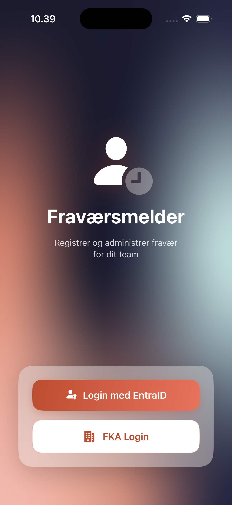
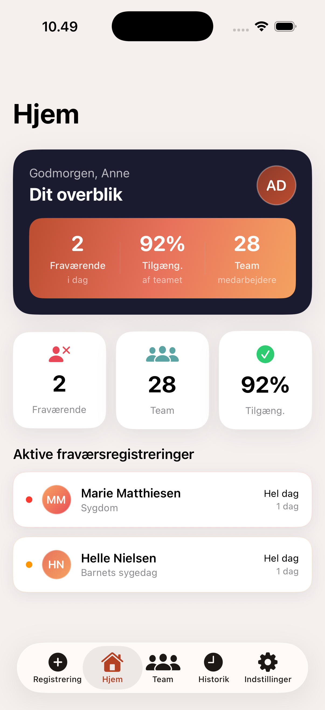
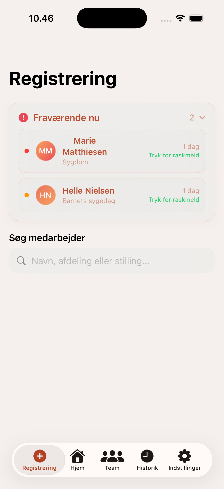
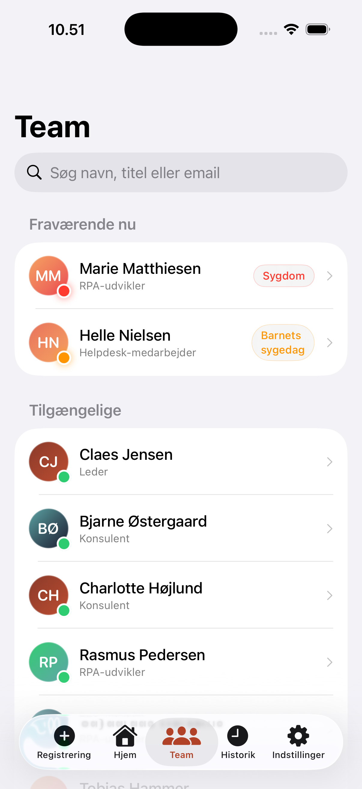
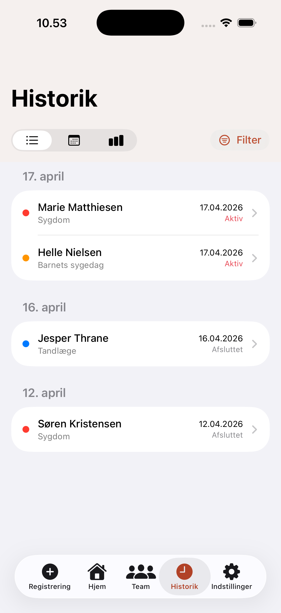
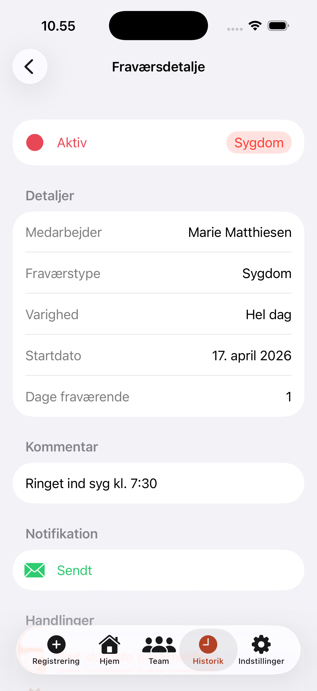

# Fraværsmelder (SickApp)

En iOS-app til ledere i Kalundborg Kommune til registrering og opfølgning af medarbejderfravær. Appen giver et komplet overblik over fraværsmønstre med statistik-dashboard, team-oversigt og hurtig registrering.

## Screenshots

<p align="center">
  
  
  
</p>

<p align="center">
  
  
  
</p>

## Funktioner

### Hjem (Dashboard)
- **Hero-kort** med dagens overblik: antal fraværende, tilgængelighed og teamstørrelse
- **Gradient KPI-kort** med terracotta-til-amber farvepalette inspireret af Kalundborg Kommunes brand
- **Aktive fraværsregistreringer** med medarbejdernavn, type og varighed
- **Quick stats** kort med fraværende, team og tilgængelighedsprocent

### Registrering
- Søg medarbejder på navn, afdeling eller stilling
- Vælg fraværstype (sygdom, barnets sygedag, tandlæge, andet)
- Besked til teamet (valgfri)
- Auto-genereret fraværsbesked til e-mail
- **Raskmelding** direkte fra aktive fraværende-listen

### Team
- Komplet oversigt over alle teammedlemmer
- Opdelt i "Fraværende nu" og "Tilgængelige"
- Søgefunktion med filtrering
- Farvekodet status-badges per fraværstype

### Historik
- **Liste-visning** med fraværsregistreringer grupperet per dato
- **Kalender-visning** med farvekodede kort
- **Statistik-dashboard** med:
  - KPI-kort: gennemsnit pr. måned, fraværsprocent, trend
  - Månedlig trend-graf (LineMark + AreaMark med catmullRom interpolation)
  - Donut-diagram for fordeling per fraværstype
  - Ugedags-heatmap (hvilke ugedage har flest sygemeldinger)
  - Bradford Factor score med farveskala

### Fraværsdetalje
- Fuld information om den enkelte fraværsregistrering
- Status, type, varighed, startdato og dage fraværende
- Kommentarfelt og notifikationsstatus
- Handlinger: raskmeld, rediger, slet

## Designsystem

Appen følger Kalundborg Kommunes brandfarver kombineret med moderne HR-app design:

| Farve | Hex | Brug |
|-------|-----|------|
| Terracotta | `#BC4D30` | Primær farve, knapper, accenter |
| Varm off-white | `#F5F0EE` | Baggrund |
| Deep navy | `#1A1B2E` | Hero-kort, mørke overflader |
| Coral | `#E8725C` | Gradient accent |
| Amber | `#F4A261` | Barnets sygedag, gradient |
| Teal | `#5BA4A4` | Andet-fravær |
| Emerald | `#2ECC71` | Tilgængelig, success |

## Teknologi

- **SwiftUI** med iOS 26+ features (MeshGradient, Charts, symbolEffect)
- **Swift Charts** til statistik-visualiseringer
- **MVVM arkitektur** med protocol-first design
- **@Observable** macro til state management
- Mock services til udvikling (klar til MSAL SDK integration)

## Krav

- Xcode 26.4+
- iOS 26.0+
- iPhone (optimeret til iPhone 17)

## Kom i gang

```bash
git clone https://github.com/Parthee-Vijaya/Sickapp.git
cd Sickapp
open SickApp.xcodeproj
```

Byg og kør i Xcode med `Cmd+R` på iPhone 17 simulator.

## Arkitektur

```
SickApp/
├── Components/          # Genbrugelige UI-komponenter
├── Core/
│   ├── Authentication/  # Auth protokol + mock
│   ├── Extensions/      # Color theme, View modifiers
│   ├── Networking/      # API client protokol + models
│   └── Persistence/     # Lokal lagring
├── Features/
│   ├── AbsenceHistory/  # Historik + statistik-dashboard
│   ├── AbsenceReport/   # Bekræftelsesview
│   ├── Analytics/       # Analyse-view
│   ├── Dashboard/       # Hjem med hero-kort
│   ├── EmployeeList/    # Team-oversigt
│   ├── Login/           # Login med MeshGradient
│   ├── Registration/    # Fraværsregistrering
│   └── Settings/        # Indstillinger
└── Mocks/               # Mock data + services
```
